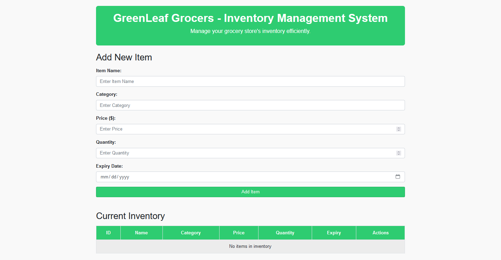

# GreenLeafGrocers

## Project Description
This is an application based on CRUD and other functionalities such as updating item details through form submission resetting form data, and so on. The project includes the use of HTML, JavaScript, and NodeJS. The data generated through the process are being kept in JSON document managed by NodeJS. The system imitates a grocery management system.

## Tools Used
- Github: [Click Here](https://github.com/)
- Github Developer Environment: [Click Here](https://github.dev/github/dev)

## Languages/Frameworks Used
- HTML, CSS, and Bootstrap
- JavaScript, and NodeJS

## Project Location
[Visit](https://github.com/sohail00123/GreenLeafGrocers) here.